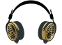
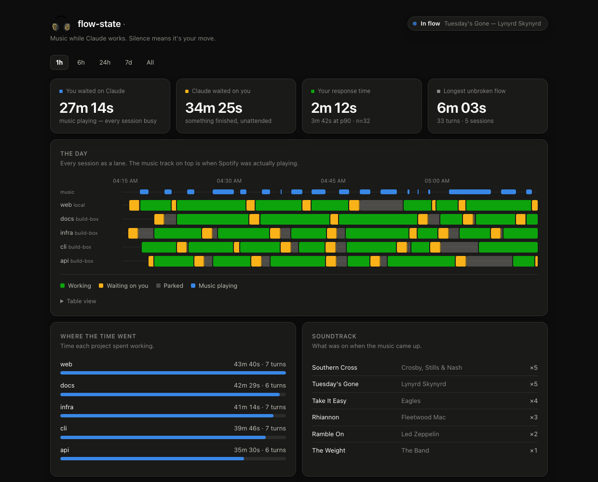

<div align="center">



# flow-state

### Music while Claude works. Silence means it's your move.

You run several Claude Code sessions at once. While they're all churning, you
have nothing to do — so flow-state fades your Spotify up. The moment *any*
session needs you, it fades the music down and pauses.

**The pause is the notification.** You stop watching spinners and start noticing
the room go quiet.

<br>

[](https://github.com/valvesss/flow-state/actions/workflows/ci.yml)
[](LICENSE)
[](https://www.python.org)
[](#what-it-doesnt-do)
[](#install)

<br>

<picture>
  <source media="(prefers-color-scheme: dark)" srcset="docs/dashboard-dark.png">
  <source media="(prefers-color-scheme: light)" srcset="docs/dashboard-light.png">
  
</picture>

<sub><code>flow-state dash</code> — every session as a lane across the day, banded by what it was doing, with the music laid over the top.</sub>

</div>

---

## Install

Requires macOS (for Spotify) and `python3`. No pip, no npm, no dependencies.

```sh
git clone https://github.com/valvesss/flow-state
cd flow-state
./install.sh
```

That copies itself to `~/.flow-state`, adds hooks to `~/.claude/settings.json`
(backing it up first), and starts the conductor under launchd.

Sessions on another machine? Install there too and register it:

```sh
./install.sh --remote build-box
```

Uninstall with `flow-state uninstall-hooks` and
`launchctl bootout gui/$UID/com.flowstate.conductor`. Everything it owns lives in
`~/.flow-state`.

## Use

```sh
flow-state status     # what it thinks right now, and why
flow-state dash       # the dashboard
flow-state stats      # the same numbers in the terminal
flow-state tune       # replay your log to pick park_after_s
flow-state off        # stop touching my music
flow-state doctor     # check the setup
```

---

## The one setting that matters

**`park_after_s`** (default 90) is the whole feel of the thing.

The pause always fires the instant a session finishes — that part isn't
negotiable, it's the product. `park_after_s` only decides how long the silence
lasts before flow-state concludes you aren't coming, marks that session
*parked*, and lets the music resume.

It's a real trade, and it's yours to make:

| `park_after_s` | music plays | silence breaks |
|---|---|---|
| 30s | 39% | 12.9/h |
| 90s | 23% | 8.3/h |
| 300s | 8% | 3.0/h |

Set it too high and — with five parallel sessions — something is *always*
freshly idle, so the music never plays at all. Set it too low and the cue is
gone before you look up.

Don't take those numbers on faith; they came from a synthetic worst case. Run
`flow-state tune` after a day and it replays **your** log at each value.

```sh
flow-state set park_after_s 60
```

## How it decides

```
play  ⟺  you're at the keyboard
         AND at least one session is working
         AND no session is waiting on you
```

A session is *waiting on you* from the moment it goes idle until `park_after_s`
later. After that it's *parked* — you already got the pause that announced it,
and you've visibly moved on, so it stops voting. Without parking, one session
left open but mentally abandoned would veto the music forever.

**You're at the keyboard** is the presence gate. flow-state infers "you're
waiting" from session state, but that's blind to whether a human is actually
there — a run grinding overnight looks identical to one you're watching. So the
conductor also reads macOS HID idle time: if you haven't touched the machine in
`away_after_s` (default 10 min), you're away and the music waits, no matter what
the sessions are doing. It's deliberately generous — HID idle measures input,
not attention, so the threshold is long enough not to interrupt watching a long
run, and far shorter than a night's sleep.

## How it works

It's **hooks**, not an extension. Claude Code fires shell commands on lifecycle
events; flow-state registers five of them:

| Hook | Means |
|---|---|
| `SessionStart` | register, idle |
| `UserPromptSubmit` | **busy** — you dispatched work |
| `Stop` | turn over — **idle**, *unless* background work is still running |
| `Notification` | **idle** — wants permission or input |
| `SessionEnd` | deregister |

Every hook is declared `"async": true`, so Claude never waits on it and its exit
code is ignored. That matters more than it sounds: a `Stop` hook that exits
non-zero *blocks the turn from ending*. No music feature is worth wedging a
session over, so the hook is fire-and-forget and swallows everything.

**A turn ending is not the same as Claude being done.** When a turn hands off to
a long-running subagent (a deep-research sweep) or a background shell command,
`Stop` fires *immediately* while the work grinds on for minutes — and that's the
purest case of you having nothing to do. So `Stop` doesn't blindly mean idle: it
reads the `background_tasks` in its own payload and keeps the session **working**
while anything there is still `running`. When that finishes, the harness
re-invokes the session and another `Stop` fires with the list drained — that one
is the real cue.

`SubagentStop` is deliberately **not** hooked — it carries the *parent's*
`session_id`, so hooking it would mark a live session idle every time a subagent
finished. (The `background_tasks` field on `Stop` gives us the same information
without that footgun.)

Each hook writes one small JSON file per session. Every writer touches only its
own path, so parallel sessions never contend and no lock is needed — the
aggregate is a directory listing.

```
    ~/.claude/settings.json ──hooks──> ~/.flow-state/run/sessions/*.json
                                                  │
    Mac  ────────────────────────────────────┐    │
                                             ▼    ▼
build-box ──ssh: flow-state watch────────> conductor ──osascript──> Spotify
                                             │
                                             └──> events.jsonl ──> dash / stats
```

**Remote hosts.** Your Mac can reach the remote box; the remote box usually
can't reach back through NAT. So the Mac pulls: it holds open
`ssh <host> flow-state watch`, which streams a JSON line whenever that host's
session set changes. No inbound port on the laptop, no tunnel, no new attack
surface — it rides SSH trust that already exists. If the link drops, that host's
sessions are treated as *gone* rather than *still busy*, because believing a
dead link would play music straight through a turn that actually finished.

**The conductor owns the event log**, not the hooks. It already observes every
transition on every host, so a single writer removes a merge and sidesteps clock
skew — every timestamp comes from one clock.

## The fades

Two things a naive version gets wrong:

**One `osascript` per fade, not one per step.** A process spawn is ~40ms; a
24-step fade as 24 spawns is a second of pure overhead and audibly steppy. The
whole ramp is emitted as a single AppleScript `repeat` loop.

**Loudness isn't linear in amplitude.** It follows roughly a power law
(Stevens', exponent ≈0.6). A linear 0→79 ramp *sounds* like it lurches up and
plateaus. To make loudness climb evenly, amplitude follows `t^1.67`:

```
volume   0 ──── 8 ──── 25 ──── 49 ──── 79
step     1      6      12      18      24
```

After pausing it restores your resting volume, so if you hit play in Spotify
yourself it isn't mysteriously silent. With `target_volume: "auto"` it learns
that volume from your own slider — nudge Spotify and flow-state retunes without
touching a config file.

**Spotify's volume scale is quantised, and it bites.** Write 79, read back 78.
Write 78, read back 77. Every set-then-read round trip loses a point:

```
79 → 78 → 77 → 76 → 75 …
```

So `auto` cannot simply believe what it reads, or it would ratchet your volume
down to silence over a day of pausing. It only relearns when the reading differs
from the learned value by more than the quantisation error can explain — i.e.
when *you* moved the slider, not when we did. The cost is that nudging Spotify
by one or two points won't register. That's the right trade against a volume
that quietly walks to zero, and there's a regression test pinning it.

Every AppleScript call is guarded by `application "Spotify" is running`, because
a bare `tell application "Spotify"` would **launch** it. flow-state never opens
an app you didn't open.

## Config

`~/.flow-state/config.json`:

| key | default | |
|---|---|---|
| `park_after_s` | `90` | how long silence waits for you |
| `away_after_s` | `600` | HID idle before you count as away (macOS) |
| `target_volume` | `"auto"` | learned from your own slider |
| `fade_in_ms` | `1200` | |
| `fade_out_ms` | `800` | |
| `remotes` | `[]` | `[{"name":"build-box","ssh":"myhost"}]` |
| `dashboard_port` | `7777` | loopback only |
| `enabled` | `true` | `flow-state on` / `off` |

## What it doesn't do

- **No network.** Nothing leaves your machine. The dashboard binds to
  `127.0.0.1`. There's no telemetry, no account, no server.
- **No patching.** It doesn't modify Claude Code's files, its CSP, or anything
  else it doesn't own. It uses the documented hook interface. Everything it
  writes is under `~/.flow-state`, plus one backed-up merge into
  `~/.claude/settings.json`.
- **No auto-update.** It's the code you cloned until you pull again.
- **No ads.** Obviously. Your wait is yours; the only thing measuring it reports
  to you.

## Development

```sh
python3 -m unittest discover -s tests -v      # 27 tests, no deps

FLOW_STATE_HOME=/tmp/fs-demo python3 scripts/demo-data.py
FLOW_STATE_HOME=/tmp/fs-demo bin/flow-state dash    # see the dashboard with fake data
```

`FLOW_STATE_HOME` relocates everything, so you can experiment without touching
your real log.

## License

MIT
